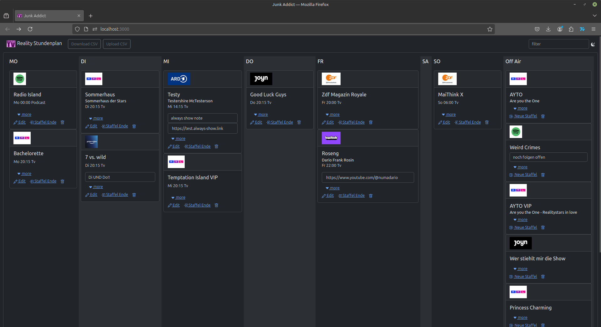

# Junk Addict

A timetable to manage all the junk you watch.

Find an example for a CSV file to upload in the application here [junkDataExport.csv](./src/data/junkDataExport_2024-10-19.csv) or download it from the application.

## Available Scripts

In the project directory, you can run:

### `npm run vite:start`

Runs the app in the development mode.\
Open [http://localhost:3000](http://localhost:3000) to view it in your browser.
