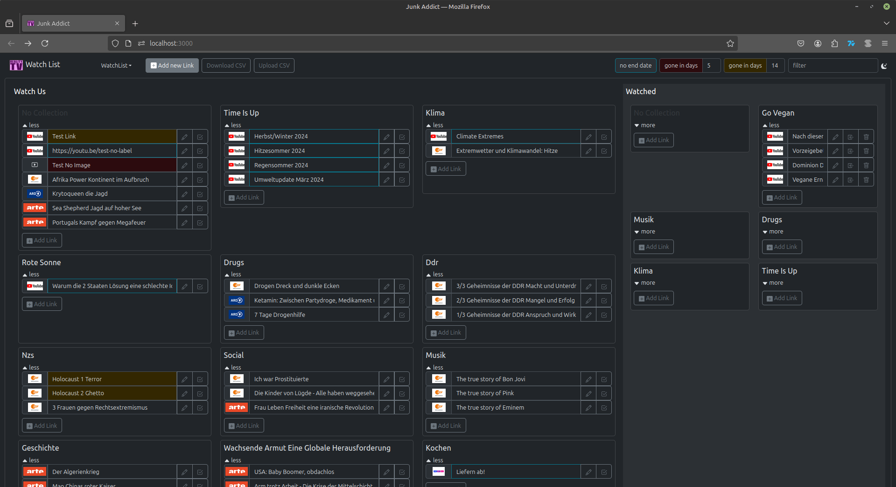

# Junk Addict
An app for everyone a little too much into TrashTV.

## Junk Table
A timetable to manage all the junk you watch. Set on air when a new season starts. Set off air when a season ended. Highlights the current week day.

Find an example for a CSV file to upload in the application here [junkDataExport.csv](./src/data/junkDataExport_2024-10-21.csv) or download it from the application.

## Watch List
Keep track of all the videos you still want to watch. Add categories and labels if you like. Remove watched links as needed.

Find an example for a CSV file to upload in the application here [watchListDataExport.csv](./src/data/watchListDataExport_2024-11-28.csv) or download it from the application.

## Available Scripts
### Docker Compose
A compose file exists you can use to build and run everything

#### `docker compose build`
or
#### `npm run compose-build`
#### `docker compose up`
or
#### `npm run compose-up`
### docker
To build the images run

#### `npm run docker-image`
and
#### `npm run docker-server`

To run the images run

#### `npm run docker-run-server`
and
#### `npm run docker-run`
### npm
In the project directory, you can run the development build

#### `npm run vite:start`

### Usage
Open [http://localhost:3000](http://localhost:3000) to view junkaddict in your browser.

### LAN Usage
To expose the application in the local network go to [local-network.env](local-network.env) and change the value of `REACT_APP_HOSTNAME` to your actual local hostname, e.g. `REACT_APP_HOSTNAME=mylaptop`

Open [http://REACT_APP_HOSTNAME:3000](http://REACT_APP_HOSTNAME:3000), e.g. [http://mylaptop:3000](http://mylaptop:3000) to view junkaddict in any browser in your network.