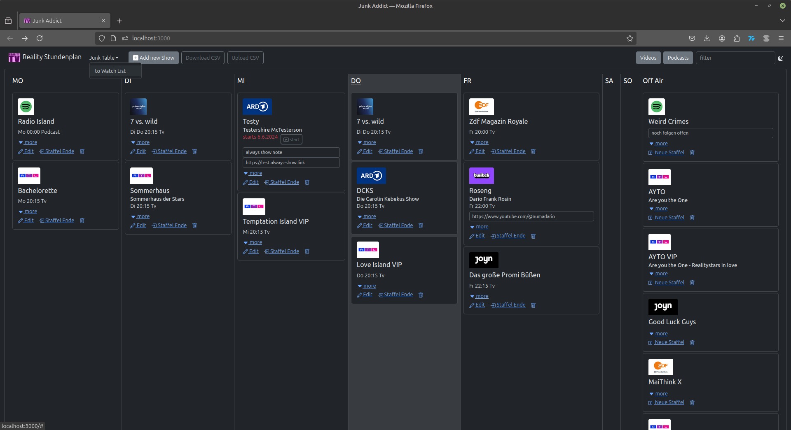
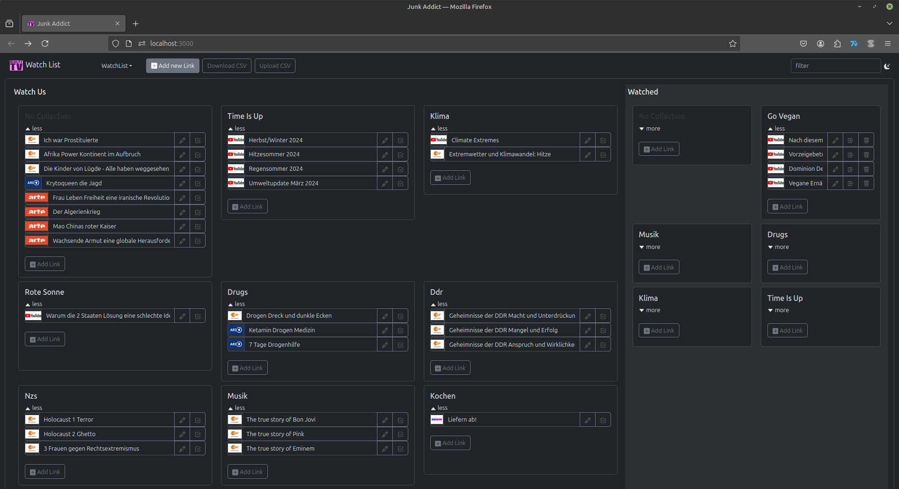

# Junk Addict
An app for everyone a little too much into TrashTV.

## Junk Table
A timetable to manage all the junk you watch. Set on air when a new season starts. Set off air when a season ended. Highlights the current week day.

Find an example for a CSV file to upload in the application here [junkDataExport.csv](./src/data/junkDataExport_2024-10-21.csv) or download it from the application.

## Watch List
Keep track of all the videos you still want to watch. Add categories and labels if you like. Remove watched links as needed.

Find an example for a CSV file to upload in the application here [watchListDataExport.csv](./src/data/watchListDataExport_2024-11-09.csv) or download it from the application.

## Available Scripts

In the project directory, you can run:

### `npm run vite:start`

Runs the app in the development mode.\
Open [http://localhost:3000](http://localhost:3000) to view it in your browser.
